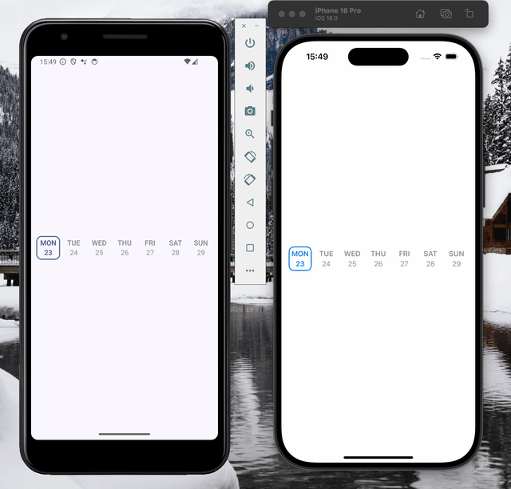

# SkipWeekCalendar



## Installing

Add the dependency inside the dependencies section in Package.swift
```swift
.package(url: "https://github.com/aduryagin/skip-week-calendar.git", branch: "main")
```

## Usage

```swift
import SwiftUI
import SkipWeekCalendar

public struct ContentView: View {
    public var body: some View {
        WeekCalendar { isSelected, isToday, date, onTap in
            // You can replace this View with your own
            WeekDayView(
                isSelected: isSelected,
                isToday: isToday,
                date: date,
                onTap: onTap
            )
        }
    }
}

```
